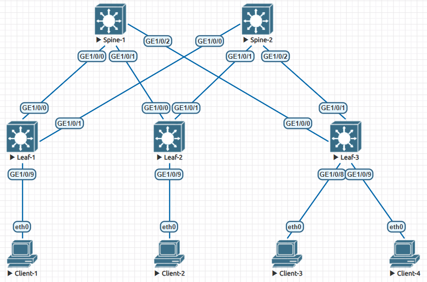

# Проектирование адресного пространства

### Цели

1. Собрать схему CLOS
2. Распределить адресное пространство

### Схема сети



### Принцип распределения IP адресов

IP = 10.Dn.Sn.X  
Dn – диапазон в зависимости от номера ЦОДа  
Sn – номер spine  
X – значение по порядку  

IP = 10.**Dn**.Sn.X  
Dn для DCN = [8*(N-1) .. (8*N-1)], где  
N – номер ЦОД (DC), N = [1 .. 32]  

Распределение внутри ЦОДа:  
Lo1 (/16) (8*(N-1))  
Lo2 (/16) (8*(N-1) + 1)  
p2p links (/16) (8*(N-1) + 2)  
резерв (/16) (8*(N-1) + 3)  
services (/16) (8*(N-1) + [4 .. 7])  

##### Пример распределение сетей для DC1

Lo1 - 10.**0**.0.0/16  
Lo2 - 10.**1**.0.0/16  
Суммарный для Lo1 и Lo2 – 10.0.0.0/15  

p2p links - 10.**2**.0.0/16  
резерв - 10.**3**.0.0/16  
Суммарный для p2p links и резерва – 10.2.0.0/15  

services -  10.**4**.0.0/16, 10.**5**.0.0/16, 10.**6**.0.0/16, 10.**7**.0.0/16  
Суммарный – 10.4.0.0/14  

##### Пример распределение IP адресов для DC1

10.0.1.0/32 – Spine 1 Lo1  
...  
10.0.N.0/32 – Spine N Lo1  

10.1.0.1/32 – Leaf 1 Lo2  
...  
10.1.0.N/32 – Leaf N Lo2  

10.2.2.4/31 – p2p Spine 2 <-> Leaf 3  
10.2.N.2*(M-1)/31 – p2p Spine N <-> Leaf M  
M= [1 .. 128]  

10.4.0.0/14 – services summary  

### IP план

Device|Interface|IP Address|Subnet Mask
---|---|---|---
Spine-1|Lo1|10.0.1.0|255.255.255.255
||Lo2|10.1.1.0|255.255.255.255
||GE1/0/0|10.2.1.0|255.255.255.254
||GE1/0/1|10.2.1.2|255.255.255.254
||GE1/0/2|10.2.1.4|255.255.255.254
Spine-2|Lo1|10.0.2.0|255.255.255.255
||Lo2|10.1.2.0|255.255.255.255
||GE1/0/0|10.2.2.0|255.255.255.254
||GE1/0/1|10.2.2.2|255.255.255.254
||GE1/0/2|10.2.2.4|255.255.255.254
Leaf-1|Lo1|10.0.0.1|255.255.255.255
||Lo2|10.1.0.1|255.255.255.255
||GE1/0/0|10.2.1.1|255.255.255.254
||GE1/0/1|10.2.2.1|255.255.255.254
||GE1/0/9|10.4.0.1|255.255.255.192
Leaf-2|Lo1|10.0.0.2|255.255.255.255
||Lo2|10.1.0.2|255.255.255.255
||GE1/0/0|10.2.1.3|255.255.255.254
||GE1/0/1|10.2.2.3|255.255.255.254
||GE1/0/9|10.4.0.65|255.255.255.192
Leaf-3|Lo1|10.0.0.3|255.255.255.255
||Lo2|10.1.0.3|255.255.255.255
||GE1/0/0|10.2.1.5|255.255.255.254
||GE1/0/1|10.2.2.5|255.255.255.254
||GE1/0/8|10.4.0.129|255.255.255.192
||GE1/0/9|10.4.0.193|255.255.255.192
Client-1|eth0|10.4.0.2|255.255.255.192
Client-2|eth0|10.4.0.66|255.255.255.192
Client-3|eth0|10.4.0.130|255.255.255.192
Client-4|eth0|10.4.0.194|255.255.255.192

### Конфигурация на оборудовании Huawei

<details>
<summary> Spine-1 </summary>

```
<Spine-1>display current-configuration
!Software Version V200R005C10SPC607B607
!Last configuration was updated at 2024-05-28 06:38:55+00:00
#
sysname Spine-1
#
interface GE1/0/0
 undo portswitch
 description to Leaf-1
 undo shutdown
 ip address 10.2.1.0 255.255.255.254
#
interface GE1/0/1
 undo portswitch
 description to Leaf-2
 undo shutdown
 ip address 10.2.1.2 255.255.255.254
#
interface GE1/0/2
 undo portswitch
 description to Leaf-3
 undo shutdown
 ip address 10.2.1.4 255.255.255.254
#
interface LoopBack1
 description Underlay
 ip address 10.0.1.0 255.255.255.255
#
interface LoopBack2
 description Overlay
 ip address 10.1.1.0 255.255.255.255
#
```

</details>

<details>
<summary> Spine-2 </summary>

```
<Spine-2>display current-configuration
!Software Version V200R005C10SPC607B607
!Last configuration was updated at 2024-05-28 06:46:12+00:00
#
sysname Spine-2
#
interface GE1/0/0
 undo portswitch
 description to Leaf-1
 undo shutdown
 ip address 10.2.2.0 255.255.255.254
#
interface GE1/0/1
 undo portswitch
 description to Leaf-2
 undo shutdown
 ip address 10.2.2.2 255.255.255.254
#
interface GE1/0/2
 undo portswitch
 description to Leaf-3
 undo shutdown
 ip address 10.2.2.4 255.255.255.254
#
interface LoopBack1
 description Underlay
 ip address 10.0.2.0 255.255.255.255
#
interface LoopBack2
 description Overlay
 ip address 10.1.2.0 255.255.255.255
#
```

</details>

<details>
<summary> Leaf-1 </summary>

```
<Leaf-1>display current-configuration
!Software Version V200R005C10SPC607B607
!Last configuration was updated at 2024-05-28 06:51:41+00:00
#
sysname Leaf-1
#
interface GE1/0/0
 undo portswitch
 description to Spine-1
 undo shutdown
 ip address 10.2.1.1 255.255.255.254
#
interface GE1/0/1
 undo portswitch
 description to Spine-2
 undo shutdown
 ip address 10.2.2.1 255.255.255.254
#
interface GE1/0/9
 undo portswitch
 description to Client-1
 undo shutdown
 ip address 10.4.0.1 255.255.255.192
#
interface LoopBack1
 description Underlay
 ip address 10.0.0.1 255.255.255.255
#
interface LoopBack2
 description Overlay
 ip address 10.1.0.1 255.255.255.255
#
```

</details>

<details>
<summary> Leaf-2 </summary>

```
<Leaf-2>display current-configuration
!Software Version V200R005C10SPC607B607
!Last configuration was updated at 2024-05-28 06:58:50+00:00
#
sysname Leaf-2
#
interface GE1/0/0
 undo portswitch
 description to Spine-1
 undo shutdown
 ip address 10.2.1.3 255.255.255.254
#
interface GE1/0/1
 undo portswitch
 description to Spine-2
 undo shutdown
 ip address 10.2.2.3 255.255.255.254
#
interface GE1/0/9
 undo portswitch
 description to Client-2
 undo shutdown
 ip address 10.4.0.65 255.255.255.192
#
interface LoopBack1
 description Underlay
 ip address 10.0.0.2 255.255.255.255
#
interface LoopBack2
 description Overlay
 ip address 10.1.0.2 255.255.255.255
#
```

</details>

<details>
<summary> Leaf-3 </summary>

```
<Leaf-3>display current-configuration
!Software Version V200R005C10SPC607B607
!Last configuration was updated at 2024-05-28 07:03:35+00:00
#
sysname Leaf-3
#
interface GE1/0/0
 undo portswitch
 description to Spine-1
 undo shutdown
 ip address 10.2.1.5 255.255.255.254
#
interface GE1/0/1
 undo portswitch
 description to Spine-2
 undo shutdown
 ip address 10.2.2.5 255.255.255.254
#
interface GE1/0/8
 undo portswitch
 description to Client-3
 undo shutdown
 ip address 10.4.0.129 255.255.255.192
#
interface GE1/0/9
 undo portswitch
 description to Client-4
 undo shutdown
 ip address 10.4.0.193 255.255.255.192
#
interface LoopBack1
 description Underlay
 ip address 10.0.0.3 255.255.255.255
#
interface LoopBack2
 description Overlay
 ip address 10.1.0.3 255.255.255.255
#
```

</details>

<details>
<summary> Clients 1-4 </summary>

```
Clinet-1> show ip

NAME        : Clinet-1[1]
IP/MASK     : 10.4.0.2/26
GATEWAY     : 10.4.0.1
DNS         :
MAC         : 00:50:79:66:68:06
LPORT       : 20000
RHOST:PORT  : 127.0.0.1:30000
MTU         : 1500


Client-2> show ip

NAME        : Client-2[1]
IP/MASK     : 10.4.0.66/26
GATEWAY     : 10.4.0.65
DNS         :
MAC         : 00:50:79:66:68:07
LPORT       : 20000
RHOST:PORT  : 127.0.0.1:30000
MTU         : 1500


Client-3> show ip

NAME        : Client-3[1]
IP/MASK     : 10.4.0.130/26
GATEWAY     : 10.4.0.129
DNS         :
MAC         : 00:50:79:66:68:08
LPORT       : 20000
RHOST:PORT  : 127.0.0.1:30000
MTU         : 1500


Client-4> show ip

NAME        : Client-4[1]
IP/MASK     : 10.4.0.194/26
GATEWAY     : 10.4.0.193
DNS         :
MAC         : 00:50:79:66:68:09
LPORT       : 20000
RHOST:PORT  : 127.0.0.1:30000
MTU         : 1500
```

</details>
