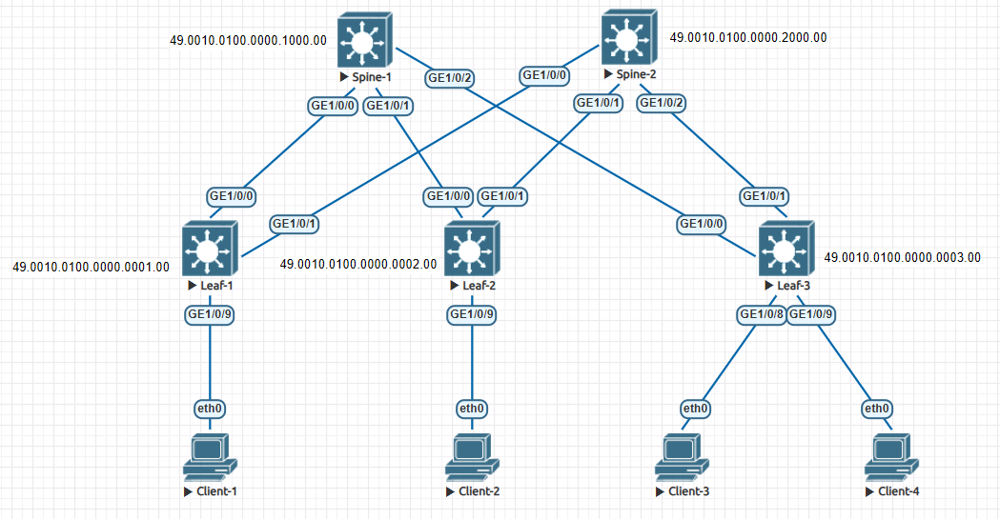

# Настройка ISIS для Underlay сети

### Цели

1. Настройка IP адресации на топологии CLOS
2. Настройка ISIS для Underlay сети на оборудовании Huawei
3. Настройка BFD для ISIS
4. Проверка наличия IP связанности между устройствами в ISIS домене

### Схема сети



### IP план

Device|Interface|IP Address|Subnet Mask
---|---|---|---
Spine-1|Lo1|10.0.1.0|255.255.255.255
||Lo2|10.1.1.0|255.255.255.255
||GE1/0/0|10.2.1.0|255.255.255.254
||GE1/0/1|10.2.1.2|255.255.255.254
||GE1/0/2|10.2.1.4|255.255.255.254
Spine-2|Lo1|10.0.2.0|255.255.255.255
||Lo2|10.1.2.0|255.255.255.255
||GE1/0/0|10.2.2.0|255.255.255.254
||GE1/0/1|10.2.2.2|255.255.255.254
||GE1/0/2|10.2.2.4|255.255.255.254
Leaf-1|Lo1|10.0.0.1|255.255.255.255
||Lo2|10.1.0.1|255.255.255.255
||GE1/0/0|10.2.1.1|255.255.255.254
||GE1/0/1|10.2.2.1|255.255.255.254
||GE1/0/9|10.4.0.1|255.255.255.192
Leaf-2|Lo1|10.0.0.2|255.255.255.255
||Lo2|10.1.0.2|255.255.255.255
||GE1/0/0|10.2.1.3|255.255.255.254
||GE1/0/1|10.2.2.3|255.255.255.254
||GE1/0/9|10.4.0.65|255.255.255.192
Leaf-3|Lo1|10.0.0.3|255.255.255.255
||Lo2|10.1.0.3|255.255.255.255
||GE1/0/0|10.2.1.5|255.255.255.254
||GE1/0/1|10.2.2.5|255.255.255.254
||GE1/0/8|10.4.0.129|255.255.255.192
||GE1/0/9|10.4.0.193|255.255.255.192
Client-1|eth0|10.4.0.2|255.255.255.192
Client-2|eth0|10.4.0.66|255.255.255.192
Client-3|eth0|10.4.0.130|255.255.255.192
Client-4|eth0|10.4.0.194|255.255.255.192

### Настройка IP адресации

Настраиваем IP адресацию на всех интерфейсах согласно IP плана и схемы сети.

Пример настройки для физического интерфейса:

    interface GE1/0/0
      undo portswitch
      description to Leaf-1
      undo shutdown
      ip address 10.2.1.0 255.255.255.254

Пример настройки для Loopback интерфейса:

    interface LoopBack1
      description Underlay
      ip address 10.0.0.1 255.255.255.255

### Настройка ISIS

На устройствах типа Leaf настраиваем L1, на устройствах типа Spine настраиваем L1/L2 (L2 оставляем для возможных расширений в будущем).

Поднимаем ISIS на устройстве. 

Пример настройки для Leaf:

    isis 1
      is-level level-1
      cost-style wide
      network-entity 49.0010.0100.0000.0001.00

NET идентификатор (идентификатор сети) состоит из:

- "AFI" (Authority and Format Identifier) - является частью номера области, хотя постоянно изображается отдельно. 
  Подавляющее большинство реализаций IS-IS на маршрутизаторах имеют это поле, равным 49. Адреса, у которых AFI был равен 49, относились к классу локальных.

- "Area ID", номер области, к которой принадлежит маршрутизатор. Это поле переменной длины.

- "System ID" - это идентификатор маршрутизатора. У каждого маршрутизатора в топологии он должен быть уникальным, 
  поскольку именно по System ID маршрутизаторы "узнают" друг друга при осознании топологии.

- "Sel" - всегда 00.

В качестве *System ID* будем использовать IP адрес Loopback1 интерфейса, в качестве *Area ID* номер региона для облегчения дебага/траблшутинга.

Тогда идентификатор сети будет вида:

49.00xx.yyyy.yyyy.yyyy.00

где
- "xx" - номер региона
- "yyyy.yyyy.yyyy" - IP адрес Loopback1 интерфейса  
    \- если IP-адрес 10.0.0.1, то yyyy.yyyy.yyyy = 010.000.000.001 = 0100.0000.0001 (недостающие разряды дополняются нулями)

Для топологии CLOS хорошо подходит ISIS в режиме работы *point-to-point*. 

Поднимаем ISIS на всех интерфейсах Leaf <-> Spine и Loopback1.

Пример настройки физического интерфейса:

    interface GE1/0/0
      isis enable 1
      isis circuit-type p2p

Пример настройки Loopback интерфейса:

    interface LoopBack1
      isis enable 1

### Настройка BFD для ISIS

Поднимаем BFD на устройстве. 

Пример настройки:

    bfd

Для того, чтобы не настраивать BFD на каждом интерфейсе, настраиваем динамический BFD для IS-IS.

Пример настройки:

    isis 1
      bfd all-interfaces enable

Проверям наличие и состояние BFD сессий с соседями:

```
<Leaf-1>display bfd session all
S: Static session
D: Dynamic session
IP: IP session
IF: Single-hop session
PEER: Multi-hop session
LDP: LDP session
LSP: Label switched path
TE: Traffic Engineering
AUTO: Automatically negotiated session
VXLAN: VXLAN session
VSI: VSI PW session
(w): State in WTR
(*): State is invalid
Total UP/DOWN Session Number : 2/0
--------------------------------------------------------------------------------
Local      Remote     PeerIpAddr      State     Type        InterfaceName
--------------------------------------------------------------------------------
16385      16388      10.2.2.0        Up        D/IP-IF      GE1/0/1
16386      16385      10.2.1.0        Up        D/IP-IF      GE1/0/0
--------------------------------------------------------------------------------
```
 
### Проверка наличия IP связанности

Для примера проверим работу ISIS и IP связность на устройстве Leaf-1

Проверям наличие ISIS соседей:

```
<Leaf-1>display isis peer

Peer Information for ISIS(1)
--------------------------------------------------------------------------------

  System ID     Interface       Circuit ID        State HoldTime(s) Type     PRI
--------------------------------------------------------------------------------
0100.0000.1000  GE1/0/0         0000000005         Up            30 L1        --
0100.0000.2000  GE1/0/1         0000000005         Up            29 L1        --

Total Peer(s): 2
```

Проверяем наличие необходимых машрутов в таблице маршрутизации:

```
<Leaf-1>display ip routing-table | include ISIS
Proto: Protocol        Pre: Preference
Route Flags: R - relay, D - download to fib, T - to vpn-instance, B - black hole route
------------------------------------------------------------------------------
Routing Table : _public_
         Destinations : 21       Routes : 23

Destination/Mask    Proto   Pre  Cost        Flags NextHop         Interface

       10.0.0.2/32  ISIS-L1 15   20            D   10.2.1.0        GE1/0/0
                    ISIS-L1 15   20            D   10.2.2.0        GE1/0/1
       10.0.0.3/32  ISIS-L1 15   20            D   10.2.1.0        GE1/0/0
                    ISIS-L1 15   20            D   10.2.2.0        GE1/0/1
       10.0.1.0/32  ISIS-L1 15   10            D   10.2.1.0        GE1/0/0
       10.0.2.0/32  ISIS-L1 15   10            D   10.2.2.0        GE1/0/1
       10.2.1.2/31  ISIS-L1 15   20            D   10.2.1.0        GE1/0/0
       10.2.1.4/31  ISIS-L1 15   20            D   10.2.1.0        GE1/0/0
       10.2.2.2/31  ISIS-L1 15   20            D   10.2.2.0        GE1/0/1
       10.2.2.4/31  ISIS-L1 15   20            D   10.2.2.0        GE1/0/1
```

Проверяем доступность Spin'ов:

```
<Leaf-1>ping 10.0.1.0
  PING 10.0.1.0: 56  data bytes, press CTRL_C to break
    Reply from 10.0.1.0: bytes=56 Sequence=1 ttl=255 time=34 ms
    Reply from 10.0.1.0: bytes=56 Sequence=2 ttl=255 time=4 ms
    Reply from 10.0.1.0: bytes=56 Sequence=3 ttl=255 time=4 ms
    Reply from 10.0.1.0: bytes=56 Sequence=4 ttl=255 time=4 ms
    Reply from 10.0.1.0: bytes=56 Sequence=5 ttl=255 time=3 ms

  --- 10.0.1.0 ping statistics ---
    5 packet(s) transmitted
    5 packet(s) received
    0.00% packet loss
    round-trip min/avg/max = 3/9/34 ms

<Leaf-1>ping 10.0.2.0
  PING 10.0.2.0: 56  data bytes, press CTRL_C to break
    Reply from 10.0.2.0: bytes=56 Sequence=1 ttl=255 time=21 ms
    Reply from 10.0.2.0: bytes=56 Sequence=2 ttl=255 time=4 ms
    Reply from 10.0.2.0: bytes=56 Sequence=3 ttl=255 time=4 ms
    Reply from 10.0.2.0: bytes=56 Sequence=4 ttl=255 time=6 ms
    Reply from 10.0.2.0: bytes=56 Sequence=5 ttl=255 time=4 ms

  --- 10.0.2.0 ping statistics ---
    5 packet(s) transmitted
    5 packet(s) received
    0.00% packet loss
    round-trip min/avg/max = 4/7/21 ms
```

Проверяем доступность Leaf'ов:

```
<Leaf-1>
<Leaf-1>ping 10.0.0.2
  PING 10.0.0.2: 56  data bytes, press CTRL_C to break
    Reply from 10.0.0.2: bytes=56 Sequence=1 ttl=254 time=24 ms
    Reply from 10.0.0.2: bytes=56 Sequence=2 ttl=254 time=6 ms
    Reply from 10.0.0.2: bytes=56 Sequence=3 ttl=254 time=7 ms
    Reply from 10.0.0.2: bytes=56 Sequence=4 ttl=254 time=7 ms
    Reply from 10.0.0.2: bytes=56 Sequence=5 ttl=254 time=5 ms

  --- 10.0.0.2 ping statistics ---
    5 packet(s) transmitted
    5 packet(s) received
    0.00% packet loss
    round-trip min/avg/max = 5/9/24 ms

<Leaf-1>ping 10.0.0.3
  PING 10.0.0.3: 56  data bytes, press CTRL_C to break
    Reply from 10.0.0.3: bytes=56 Sequence=1 ttl=254 time=26 ms
    Reply from 10.0.0.3: bytes=56 Sequence=2 ttl=254 time=7 ms
    Reply from 10.0.0.3: bytes=56 Sequence=3 ttl=254 time=6 ms
    Reply from 10.0.0.3: bytes=56 Sequence=4 ttl=254 time=9 ms
    Reply from 10.0.0.3: bytes=56 Sequence=5 ttl=254 time=6 ms

  --- 10.0.0.3 ping statistics ---
    5 packet(s) transmitted
    5 packet(s) received
    0.00% packet loss
    round-trip min/avg/max = 6/10/26 ms
```

### Конфигурация на оборудовании Huawei

<details>
<summary> Spine-1 </summary>

```

```

</details>

<details>
<summary> Spine-2 </summary>

```

```

</details>

<details>
<summary> Leaf-1 </summary>

```
<Leaf-1>display current-configuration
!Software Version V200R005C10SPC607B607
!Last configuration was updated at 2024-05-31 14:46:39+00:00 by SYSTEM automatically
!Last configuration was saved at 2024-05-31 14:44:09+00:00
#
sysname Leaf-1
#
bfd
#
isis 1
 is-level level-1
 cost-style wide
 bfd all-interfaces enable
 network-entity 49.0010.0100.0000.0001.00
#
interface GE1/0/0
 undo portswitch
 description to Spine-1
 undo shutdown
 ip address 10.2.1.1 255.255.255.254
 isis enable 1
 isis circuit-type p2p
#
interface GE1/0/1
 undo portswitch
 description to Spine-2
 undo shutdown
 ip address 10.2.2.1 255.255.255.254
 isis enable 1
 isis circuit-type p2p
#
interface GE1/0/9
 undo portswitch
 description to Client-1
 undo shutdown
 ip address 10.4.0.1 255.255.255.192
#
interface LoopBack1
 description Underlay
 ip address 10.0.0.1 255.255.255.255
 isis enable 1
#
interface LoopBack2
 description Overlay
 ip address 10.1.0.1 255.255.255.255
#
```

</details>

<details>
<summary> Leaf-2 </summary>

```

```

</details>

<details>
<summary> Leaf-3 </summary>

```

```

</details>
