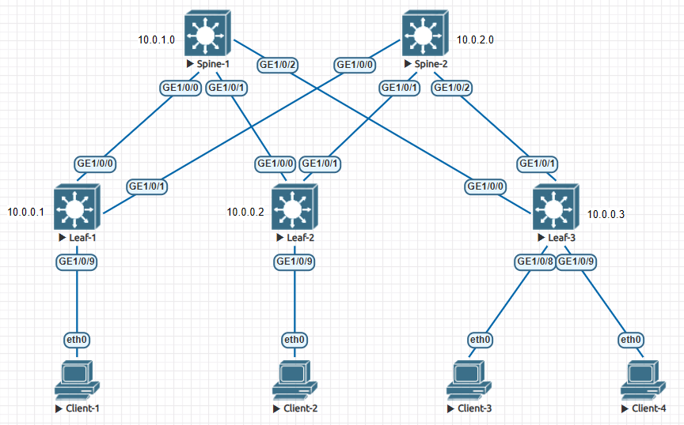

# Настройка iBGP для Underlay сети

### Цели

1. Настройка IP адресации на топологии CLOS
2. Настройка iBGP для Underlay сети на оборудовании Huawei
3. Проверка наличия IP связанности между устройствами в iBGP домене

### Схема сети



### IP план

Device|Interface|IP Address|Subnet Mask
---|---|---|---
Spine-1|Lo1|10.0.1.0|255.255.255.255
||Lo2|10.1.1.0|255.255.255.255
||GE1/0/0|10.2.1.0|255.255.255.254
||GE1/0/1|10.2.1.2|255.255.255.254
||GE1/0/2|10.2.1.4|255.255.255.254
Spine-2|Lo1|10.0.2.0|255.255.255.255
||Lo2|10.1.2.0|255.255.255.255
||GE1/0/0|10.2.2.0|255.255.255.254
||GE1/0/1|10.2.2.2|255.255.255.254
||GE1/0/2|10.2.2.4|255.255.255.254
Leaf-1|Lo1|10.0.0.1|255.255.255.255
||Lo2|10.1.0.1|255.255.255.255
||GE1/0/0|10.2.1.1|255.255.255.254
||GE1/0/1|10.2.2.1|255.255.255.254
||GE1/0/9|10.4.0.1|255.255.255.192
Leaf-2|Lo1|10.0.0.2|255.255.255.255
||Lo2|10.1.0.2|255.255.255.255
||GE1/0/0|10.2.1.3|255.255.255.254
||GE1/0/1|10.2.2.3|255.255.255.254
||GE1/0/9|10.4.0.65|255.255.255.192
Leaf-3|Lo1|10.0.0.3|255.255.255.255
||Lo2|10.1.0.3|255.255.255.255
||GE1/0/0|10.2.1.5|255.255.255.254
||GE1/0/1|10.2.2.5|255.255.255.254
||GE1/0/8|10.4.0.129|255.255.255.192
||GE1/0/9|10.4.0.193|255.255.255.192
Client-1|eth0|10.4.0.2|255.255.255.192
Client-2|eth0|10.4.0.66|255.255.255.192
Client-3|eth0|10.4.0.130|255.255.255.192
Client-4|eth0|10.4.0.194|255.255.255.192

### Настройка IP адресации

Настраиваем IP адресацию на всех интерфейсах согласно IP плана и схемы сети.

Пример настройки для физического интерфейса:

    interface GE1/0/0
      undo portswitch
      description to Leaf-1
      undo shutdown
      ip address 10.2.1.0 255.255.255.254

Пример настройки для Loopback интерфейса:

    interface LoopBack1
      description Underlay
      ip address 10.0.0.1 255.255.255.255

### Настройка iBGP

Поднимаем OSPF на устройстве и анонсируем подсеть Lo1 в OSPF домен. В качестве router id используем IP с интерфейса Loopback1.

Пример настройки:

    router id 10.0.0.1
    #
    ospf 1
      suppress-reachability
      area 0.0.0.0
        network 10.0.0.0 0.0.255.255

*suppress-reachability* - убирает анонсы p2p IP адресации из OSPF домена.

Для топологии CLOS хорошо подходит OSPF в режиме работы *point-to-point*. 

*point-to-point* - Используется для указания двухточечного типа сети, когда один канал соединяет только два маршрутизатора. И поэтому нет необходимости в ручном конфигурировании соседних устройств. Для каждого логического канала при реализации двухточечных соединений используется своя подсеть. В данном типе сети OSPF выборы назначенных маршрутизаторов не осуществляются, а установка отношений смежности осуществляется автоматически с помощью периодической рассылки hello пакетов. Данный тип сети применяется, когда требуется установить отношения смежности только между маршрутизаторами.
 
Поднимаем OSPF на всех интерфейсах Leaf <-> Spine.

Пример настройки интерфейса:

    interface GE1/0/0
      ospf network-type p2p
      ospf enable 1 area 0.0.0.0

### Проверка наличия IP связанности

Для примера проверим работу iBGP и IP связность на устройстве Leaf-1

Проверям наличие iBGP соседей:

```

```

Проверяем наличие необходимых машрутов в таблице маршрутизации:

```

```

Проверяем доступность Spin'ов:

```

```

Проверяем доступность Leaf'ов:

```

```

### Конфигурация на оборудовании Huawei

<details>
<summary> Spine-1 </summary>

```

```

</details>

<details>
<summary> Spine-2 </summary>

```

```

</details>

<details>
<summary> Leaf-1 </summary>

```

```

</details>

<details>
<summary> Leaf-2 </summary>

```

```

</details>

<details>
<summary> Leaf-3 </summary>

```

```

</details>
