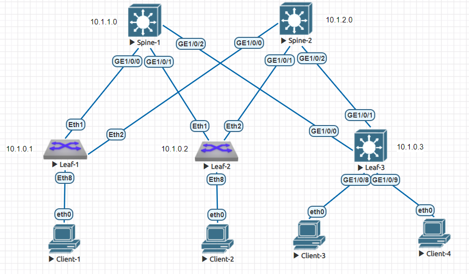

# Настройка VxLAN. L2 VNI

### Цели

1. Настройка IP адресации на топологии CLOS
2. Настройка ISIS для Underlay сети на оборудовании Huawei/Arista
3. Настройка Overlay на основе VxLAN EVPN для L2 связанности между клиентами
4. Проверка наличия IP связанности между клиентами

### Схема сети



Ввиду того, что на оборудовании Huawei в тестовом стенде не отрабатывает BGP EVPN control plane на Leaf устройствах было принято решение все Leaf заменить на Arista. Устройства Spine оставляем на Huawei.

### IP план

Device|Interface|IP Address|Subnet Mask
---|---|---|---
Spine-1|Lo1|10.0.1.0|255.255.255.255
||Lo2|10.1.1.0|255.255.255.255
||GE1/0/0|10.2.1.0|255.255.255.254
||GE1/0/1|10.2.1.2|255.255.255.254
||GE1/0/2|10.2.1.4|255.255.255.254
Spine-2|Lo1|10.0.2.0|255.255.255.255
||Lo2|10.1.2.0|255.255.255.255
||GE1/0/0|10.2.2.0|255.255.255.254
||GE1/0/1|10.2.2.2|255.255.255.254
||GE1/0/2|10.2.2.4|255.255.255.254
Leaf-1|Lo1|10.0.0.1|255.255.255.255
||Lo2|10.1.0.1|255.255.255.255
||Eth1|10.2.1.1|255.255.255.254
||Eth2|10.2.2.1|255.255.255.254
Leaf-2|Lo1|10.0.0.2|255.255.255.255
||Lo2|10.1.0.2|255.255.255.255
||Eth1|10.2.1.3|255.255.255.254
||Eth2|10.2.2.3|255.255.255.254
Leaf-3|Lo1|10.0.0.3|255.255.255.255
||Lo2|10.1.0.3|255.255.255.255
||GE1/0/0|10.2.1.5|255.255.255.254
||GE1/0/1|10.2.2.5|255.255.255.254
Client-1|eth0|10.4.0.2|255.255.255.192
Client-2|eth0|10.4.0.3|255.255.255.192

### Настройка IP адресации

Настраиваем IP адресацию на всех интерфейсах согласно IP плана и схемы сети.

Пример настройки для физического интерфейса на Huawei:

    interface GE1/0/0
      undo portswitch
      description to Leaf-1
      undo shutdown
      ip address 10.2.1.0 255.255.255.254

Пример настройки для физического интерфейса на Arista:

    interface Ethernet1
       description to Spine-1
       no switchport
       ip address 10.2.1.1/31

Пример настройки для Loopback интерфейса на Huawei:

    interface LoopBack1
      description Underlay
      ip address 10.0.0.1 255.255.255.255

Пример настройки для Loopback интерфейса на Arista:

    interface Loopback1
       description Underlay
       ip address 10.0.0.1/32

### Настройка ISIS для Underlay

Поднимаем iBGP на устройстве. В качестве router id используем IP с интерфейса Loopback1.

Пример настройки:

    bgp 65000
     router-id 10.0.0.1

Для минимизации настроек будем использовать BGP Peer Group при настройке BGP соседей. BGP Peer Group позволяет задавать единые настройки для всех соседей в группе. При этом на Spine лучше использовать Dynamic BGP Peer Group, что позволеят не менять настройки Spine при добавление новых Leaf. Но к сожалению тестовый стенд не позволяет настроить динамические группы, поэтому будем использовать обычные группы как на Leaf, так и на Spine.
 
Пример настройки iBGP соседства:

```
 group SPINES internal
 peer 10.2.1.0 as-number 65000
 peer 10.2.1.0 group SPINES
 peer 10.2.2.0 as-number 65000
 peer 10.2.2.0 group SPINES
 #
 ipv4-family unicast
  peer SPINES enable
  peer 10.2.1.0 enable
  peer 10.2.1.0 group SPINES
  peer 10.2.2.0 enable
  peer 10.2.2.0 group SPINES
```

Анонсируем IP-адреса Lo1 интрефесов и стыковочные p2p-сети в BGP:

      network 10.0.0.1 255.255.255.255
      network 10.2.1.0 255.255.255.254
      network 10.2.2.0 255.255.255.254

Так как у нас нет связей между Leaf'ами, то необходимо на Spine настроить механизм Route Reflector. Это повзолит Leaf'ам получать все маршруты с других Leaf. 

Пример настройки на Spine:

    bgp 65000
      #
      ipv4-family unicast
        peer LEAVES reflect-client

### Настройка Overlay на основе VxLAN EVPN для L2 связанности между клиентами


### Проверка наличия IP связанности

Для примера проверим работу iBGP и IP связность на устройстве Leaf-1

Проверям наличие iBGP соседей:

```
<Leaf-1>display bgp peer
 BGP local router ID        : 10.0.0.1
 Local AS number            : 65000
 Total number of peers      : 2
 Peers in established state : 2

  Peer            V          AS  MsgRcvd  MsgSent  OutQ  Up/Down       State  PrefRcv
  10.2.1.0        4       65000     6236     6215     0 11:00:15 Established        8
  10.2.2.0        4       65000     4347     4348     0 02:27:44 Established        8
```

Проверяем наличие необходимых машрутов в таблице маршрутизации:

```
<Leaf-1>display ip routing-table | include BGP
Proto: Protocol        Pre: Preference
Route Flags: R - relay, D - download to fib, T - to vpn-instance, B - black hole route
------------------------------------------------------------------------------
Routing Table : _public_
         Destinations : 21       Routes : 27

Destination/Mask    Proto   Pre  Cost        Flags NextHop         Interface

       10.0.0.2/32  IBGP    255  0             RD  10.2.1.3        GE1/0/0
                    IBGP    255  0             RD  10.2.2.3        GE1/0/1
       10.0.0.3/32  IBGP    255  0             RD  10.2.1.5        GE1/0/0
                    IBGP    255  0             RD  10.2.2.5        GE1/0/1
       10.0.1.0/32  IBGP    255  0             RD  10.2.1.0        GE1/0/0
       10.0.2.0/32  IBGP    255  0             RD  10.2.2.0        GE1/0/1
       10.2.1.2/31  IBGP    255  0             RD  10.2.1.0        GE1/0/0
                    IBGP    255  0             RD  10.2.2.3        GE1/0/1
       10.2.1.4/31  IBGP    255  0             RD  10.2.1.0        GE1/0/0
                    IBGP    255  0             RD  10.2.2.5        GE1/0/1
       10.2.2.2/31  IBGP    255  0             RD  10.2.2.0        GE1/0/1
                    IBGP    255  0             RD  10.2.1.3        GE1/0/0
       10.2.2.4/31  IBGP    255  0             RD  10.2.2.0        GE1/0/1
                    IBGP    255  0             RD  10.2.1.5        GE1/0/0
```

Проверяем доступность Spin'ов:

```
<Leaf-1>ping 10.0.1.0
  PING 10.0.1.0: 56  data bytes, press CTRL_C to break
    Reply from 10.0.1.0: bytes=56 Sequence=1 ttl=255 time=30 ms
    Reply from 10.0.1.0: bytes=56 Sequence=2 ttl=255 time=4 ms
    Reply from 10.0.1.0: bytes=56 Sequence=3 ttl=255 time=5 ms
    Reply from 10.0.1.0: bytes=56 Sequence=4 ttl=255 time=5 ms
    Reply from 10.0.1.0: bytes=56 Sequence=5 ttl=255 time=6 ms

  --- 10.0.1.0 ping statistics ---
    5 packet(s) transmitted
    5 packet(s) received
    0.00% packet loss
    round-trip min/avg/max = 4/10/30 ms

<Leaf-1>ping 10.0.2.0
  PING 10.0.2.0: 56  data bytes, press CTRL_C to break
    Reply from 10.0.2.0: bytes=56 Sequence=1 ttl=255 time=18 ms
    Reply from 10.0.2.0: bytes=56 Sequence=2 ttl=255 time=4 ms
    Reply from 10.0.2.0: bytes=56 Sequence=3 ttl=255 time=4 ms
    Reply from 10.0.2.0: bytes=56 Sequence=4 ttl=255 time=3 ms
    Reply from 10.0.2.0: bytes=56 Sequence=5 ttl=255 time=7 ms

  --- 10.0.2.0 ping statistics ---
    5 packet(s) transmitted
    5 packet(s) received
    0.00% packet loss
    round-trip min/avg/max = 3/7/18 ms
```

Проверяем доступность Leaf'ов:

```
<Leaf-1>ping 10.0.0.2
  PING 10.0.0.2: 56  data bytes, press CTRL_C to break
    Reply from 10.0.0.2: bytes=56 Sequence=1 ttl=254 time=33 ms
    Reply from 10.0.0.2: bytes=56 Sequence=2 ttl=254 time=7 ms
    Reply from 10.0.0.2: bytes=56 Sequence=3 ttl=254 time=7 ms
    Reply from 10.0.0.2: bytes=56 Sequence=4 ttl=254 time=7 ms
    Reply from 10.0.0.2: bytes=56 Sequence=5 ttl=254 time=6 ms

  --- 10.0.0.2 ping statistics ---
    5 packet(s) transmitted
    5 packet(s) received
    0.00% packet loss
    round-trip min/avg/max = 6/12/33 ms

<Leaf-1>ping 10.0.0.3
  PING 10.0.0.3: 56  data bytes, press CTRL_C to break
    Reply from 10.0.0.3: bytes=56 Sequence=1 ttl=254 time=17 ms
    Reply from 10.0.0.3: bytes=56 Sequence=2 ttl=254 time=7 ms
    Reply from 10.0.0.3: bytes=56 Sequence=3 ttl=254 time=8 ms
    Reply from 10.0.0.3: bytes=56 Sequence=4 ttl=254 time=9 ms
    Reply from 10.0.0.3: bytes=56 Sequence=5 ttl=254 time=7 ms

  --- 10.0.0.3 ping statistics ---
    5 packet(s) transmitted
    5 packet(s) received
    0.00% packet loss
    round-trip min/avg/max = 7/9/17 ms
```

### Конфигурация на оборудовании Huawei/Arista

<details>
<summary> Spine-1 </summary>

```

```

</details>

<details>
<summary> Spine-2 </summary>

```

```

</details>

<details>
<summary> Leaf-1 </summary>

```

```

</details>

<details>
<summary> Leaf-2 </summary>

```

```

</details>

<details>
<summary> Leaf-3 </summary>

```

```

</details>
