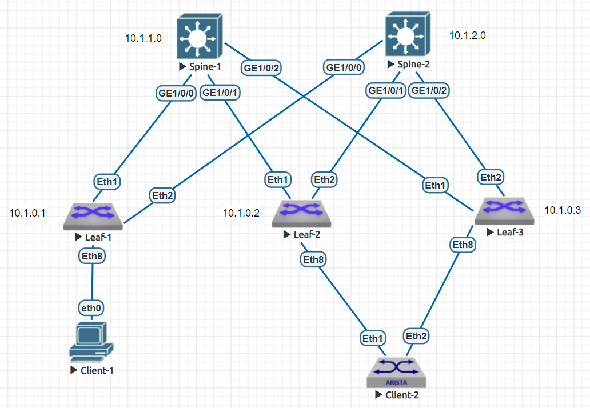

# Настройка VxLAN. Multihoming

### Цели

1. Подключение клиента 2-я линками к различным Leaf и настройка агрегированного канала со стороны клиента
2. Настройка отказоустойчивого подключения клиента с использованием EVPN Multihoming (ESI LAG)
3. Проверка наличия IP связанности между клиентами
4. Тестирование отказоустойчивости - убедиться, что связнность не теряется при отключении одного из линков

### Схема сети



Базовые настройки сети Underlay, а так же BGP EVPN были рассмотрены в рамках лабораторной работы №5. Воспользуемся ими в данной работе.

### IP план

Device|Interface|IP Address|Subnet Mask
---|---|---|---
Spine-1|Lo1|10.0.1.0|255.255.255.255
||Lo2|10.1.1.0|255.255.255.255
||GE1/0/0|10.2.1.0|255.255.255.254
||GE1/0/1|10.2.1.2|255.255.255.254
||GE1/0/2|10.2.1.4|255.255.255.254
Spine-2|Lo1|10.0.2.0|255.255.255.255
||Lo2|10.1.2.0|255.255.255.255
||GE1/0/0|10.2.2.0|255.255.255.254
||GE1/0/1|10.2.2.2|255.255.255.254
||GE1/0/2|10.2.2.4|255.255.255.254
Leaf-1|Lo1|10.0.0.1|255.255.255.255
||Lo2|10.1.0.1|255.255.255.255
||Eth1|10.2.1.1|255.255.255.254
||Eth2|10.2.2.1|255.255.255.254
Leaf-2|Lo1|10.0.0.2|255.255.255.255
||Lo2|10.1.0.2|255.255.255.255
||Eth1|10.2.1.3|255.255.255.254
||Eth2|10.2.2.3|255.255.255.254
Leaf-3|Lo1|10.0.0.3|255.255.255.255
||Lo2|10.1.0.3|255.255.255.255
||GE1/0/0|10.2.1.5|255.255.255.254
||GE1/0/1|10.2.2.5|255.255.255.254
Client-1|eth0|10.4.0.1|255.255.255.192
Client-2|Po1|10.4.0.2|255.255.255.192

### Настройка агрегированного канала со стороны клиента

В качестве Client-2 будем использовать коммутатор Arista, т.к. с Huawei опять возникли проблемы в работе data plane. Настроим Port-Channel в режиме active/active и добавил в него нужные интерфейсы.

Пример настройки Client-2 (Arista):

```
interface Port-Channel1
   description to Leaf-2/3
   no switchport
   ip address 10.4.0.2/26
!
interface Ethernet1
   description to Leaf-2
   channel-group 1 mode active
!
interface Ethernet2
   description to Leaf-3
   channel-group 1 mode active
```

### Настройка отказоустойчивого подключения клиента с использованием EVPN Multihoming

Для настройки EVPN Multihoming нам необходимо на Leaf которые задействованы в данной схеме выполнить одинаковые настройки для Etherchannel и задать следующие параметры:

**Ethernet Segment Identifier (ESI)**. Для простоты настройки и отладки предлагается использовать следующий формат: 0000:0000:\<lower-leaf-ID\>:\<higher-leaf-ID\>:\<port-channel-ID\>. Например в нашем случае получается: *0000:0000:0002:0003:0023*

**route-target** необходим для того, чтоб только Leaf'ы обслуживающие ESI могли импортировать данные маршруты. Предлагается использовать принцип формирования как и для ESI: \<lower-leaf-ID\>:\<higher-leaf-ID\>:\<port-channel-ID\>. Например в нашем случае получается: *00:02:00:03:00:23*

**lacp system-id** необходим для того, чтоб устройство Client-2 считало, что поднимет LACP с одним и тем же устройством.  Предлагается использовать следующий формат: 0000:\<lower-node-ID\>:\<higher-node-ID\>. Например в нашем случае получается: *0000.0002.0003*

Пример настройки Port-Channel на Leaf-2 (для Leaf-3 настройки идентичные):

      interface Port-Channel23
         description to Client-2
         switchport access vlan 200
         !
         evpn ethernet-segment
            identifier 0000:0000:0002:0003:0023
            route-target import 00:02:00:03:00:23
         lacp system-id 0000.0002.0003

Так же добавляем требуемый интерфейс в наш Port-Channel в режиме active:

      interface Ethernet8
         description to Client-2
         channel-group 23 mode active

### Настройка VXLAN L2 VNI между клиентами

Более подробно настройка описана в лабораторной работе №5.

Пример настройки для Leaf-1:

```
interface Vxlan1
   vxlan source-interface Loopback1
   vxlan udp-port 4789
   vxlan vlan 100 vni 10100
   vxlan learn-restrict any
!
router bgp 65000
   vlan 100
      rd 10.1.0.1:10100
      route-target both 65000:10100
      redistribute learned
```

Пример настройки для Leaf-2:

```
interface Vxlan1
   vxlan source-interface Loopback1
   vxlan udp-port 4789
   vxlan vlan 200 vni 10100
   vxlan learn-restrict any
!
router bgp 65000
   vlan 200
      rd 10.1.0.2:10100
      route-target both 65000:10100
      redistribute learned
```

### Проверка наличия IP связанности между клиентами

Проверяем наличия IP связанности между клиентами:

```
Client-1> ping 10.4.0.2

84 bytes from 10.4.0.2 icmp_seq=1 ttl=64 time=103.350 ms
84 bytes from 10.4.0.2 icmp_seq=2 ttl=64 time=49.127 ms
84 bytes from 10.4.0.2 icmp_seq=3 ttl=64 time=42.259 ms
84 bytes from 10.4.0.2 icmp_seq=4 ttl=64 time=44.458 ms
84 bytes from 10.4.0.2 icmp_seq=5 ttl=64 time=48.386 ms
```

Так же на Leaf видим, что появились машруты type 1 auto-discovery

```
Leaf-1(config)#show bgp evpn route-type auto-discovery
BGP routing table information for VRF default
Router identifier 10.1.0.1, local AS number 65000
Route status codes: * - valid, > - active, S - Stale, E - ECMP head, e - ECMP
                    c - Contributing to ECMP, % - Pending BGP convergence
Origin codes: i - IGP, e - EGP, ? - incomplete
AS Path Attributes: Or-ID - Originator ID, C-LST - Cluster List, LL Nexthop - Link Local Nexthop

          Network                Next Hop              Metric  LocPref Weight  Path
 * >Ec    RD: 10.1.0.2:10100 auto-discovery 0 0000:0000:0002:0003:0023
                                 10.0.0.2              -       100     0       i Or-ID: 10.1.0.2 C-LST: 10.1.1.0
 *  ec    RD: 10.1.0.2:10100 auto-discovery 0 0000:0000:0002:0003:0023
                                 10.0.0.2              -       100     0       i Or-ID: 10.1.0.2 C-LST: 10.1.2.0
 * >Ec    RD: 10.1.0.3:10100 auto-discovery 0 0000:0000:0002:0003:0023
                                 10.0.0.3              -       100     0       i Or-ID: 10.1.0.3 C-LST: 10.1.2.0
 *  ec    RD: 10.1.0.3:10100 auto-discovery 0 0000:0000:0002:0003:0023
                                 10.0.0.3              -       100     0       i Or-ID: 10.1.0.3 C-LST: 10.1.1.0
 * >Ec    RD: 10.0.0.2:1 auto-discovery 0000:0000:0002:0003:0023
                                 10.0.0.2              -       100     0       i Or-ID: 10.1.0.2 C-LST: 10.1.1.0
 *  ec    RD: 10.0.0.2:1 auto-discovery 0000:0000:0002:0003:0023
                                 10.0.0.2              -       100     0       i Or-ID: 10.1.0.2 C-LST: 10.1.2.0
 * >Ec    RD: 10.0.0.3:1 auto-discovery 0000:0000:0002:0003:0023
                                 10.0.0.3              -       100     0       i Or-ID: 10.1.0.3 C-LST: 10.1.2.0
 *  ec    RD: 10.0.0.3:1 auto-discovery 0000:0000:0002:0003:0023
                                 10.0.0.3              -       100     0       i Or-ID: 10.1.0.3 C-LST: 10.1.1.0
```

и машруты type 4 ethernet-segment

```
Leaf-1(config)#show bgp evpn route-type ethernet-segment
BGP routing table information for VRF default
Router identifier 10.1.0.1, local AS number 65000
Route status codes: * - valid, > - active, S - Stale, E - ECMP head, e - ECMP
                    c - Contributing to ECMP, % - Pending BGP convergence
Origin codes: i - IGP, e - EGP, ? - incomplete
AS Path Attributes: Or-ID - Originator ID, C-LST - Cluster List, LL Nexthop - Link Local Nexthop

          Network                Next Hop              Metric  LocPref Weight  Path
 * >Ec    RD: 10.0.0.2:1 ethernet-segment 0000:0000:0002:0003:0023 10.0.0.2
                                 10.0.0.2              -       100     0       i Or-ID: 10.1.0.2 C-LST: 10.1.2.0
 *  ec    RD: 10.0.0.2:1 ethernet-segment 0000:0000:0002:0003:0023 10.0.0.2
                                 10.0.0.2              -       100     0       i Or-ID: 10.1.0.2 C-LST: 10.1.1.0
 * >Ec    RD: 10.0.0.3:1 ethernet-segment 0000:0000:0002:0003:0023 10.0.0.3
                                 10.0.0.3              -       100     0       i Or-ID: 10.1.0.3 C-LST: 10.1.2.0
 *  ec    RD: 10.0.0.3:1 ethernet-segment 0000:0000:0002:0003:0023 10.0.0.3
                                 10.0.0.3              -       100     0       i Or-ID: 10.1.0.3 C-LST: 10.1.1.0
```

### Тестирование отказоустойчивости.

Для проверки отказоустойчивости, смоделируем падение одного из линков в сторону клиента и проверим наличие IP связности между клиентами и наличе маршрутов type 1 и type 4.

Видим, что связность между клиентами не пропала.

```
Client-1> ping 10.4.0.2

84 bytes from 10.4.0.2 icmp_seq=1 ttl=64 time=183.274 ms
84 bytes from 10.4.0.2 icmp_seq=2 ttl=64 time=65.176 ms
84 bytes from 10.4.0.2 icmp_seq=3 ttl=64 time=42.046 ms
84 bytes from 10.4.0.2 icmp_seq=4 ttl=64 time=38.055 ms
84 bytes from 10.4.0.2 icmp_seq=5 ttl=64 time=37.929 ms
```

При этому у нас пропали машруты с Leaf-2.

```
Leaf-1(config)#show bgp evpn route-type auto-discovery
BGP routing table information for VRF default
Router identifier 10.1.0.1, local AS number 65000
Route status codes: * - valid, > - active, S - Stale, E - ECMP head, e - ECMP
                    c - Contributing to ECMP, % - Pending BGP convergence
Origin codes: i - IGP, e - EGP, ? - incomplete
AS Path Attributes: Or-ID - Originator ID, C-LST - Cluster List, LL Nexthop - Link Local Nexthop

          Network                Next Hop              Metric  LocPref Weight  Path
 * >Ec    RD: 10.1.0.3:10100 auto-discovery 0 0000:0000:0002:0003:0023
                                 10.0.0.3              -       100     0       i Or-ID: 10.1.0.3 C-LST: 10.1.2.0
 *  ec    RD: 10.1.0.3:10100 auto-discovery 0 0000:0000:0002:0003:0023
                                 10.0.0.3              -       100     0       i Or-ID: 10.1.0.3 C-LST: 10.1.1.0
 * >Ec    RD: 10.0.0.3:1 auto-discovery 0000:0000:0002:0003:0023
                                 10.0.0.3              -       100     0       i Or-ID: 10.1.0.3 C-LST: 10.1.2.0
 *  ec    RD: 10.0.0.3:1 auto-discovery 0000:0000:0002:0003:0023
                                 10.0.0.3              -       100     0       i Or-ID: 10.1.0.3 C-LST: 10.1.1.0
```

```
Leaf-1(config)#show bgp evpn route-type ethernet-segment
BGP routing table information for VRF default
Router identifier 10.1.0.1, local AS number 65000
Route status codes: * - valid, > - active, S - Stale, E - ECMP head, e - ECMP
                    c - Contributing to ECMP, % - Pending BGP convergence
Origin codes: i - IGP, e - EGP, ? - incomplete
AS Path Attributes: Or-ID - Originator ID, C-LST - Cluster List, LL Nexthop - Link Local Nexthop

          Network                Next Hop              Metric  LocPref Weight  Path
 * >Ec    RD: 10.0.0.3:1 ethernet-segment 0000:0000:0002:0003:0023 10.0.0.3
                                 10.0.0.3              -       100     0       i Or-ID: 10.1.0.3 C-LST: 10.1.2.0
 *  ec    RD: 10.0.0.3:1 ethernet-segment 0000:0000:0002:0003:0023 10.0.0.3
                                 10.0.0.3              -       100     0       i Or-ID: 10.1.0.3 C-LST: 10.1.1.0
```

### Конфигурация на оборудовании Huawei/Arista

<details>
<summary> Spine-1 </summary>

```
<Spine-1>display current-configuration
!Software Version V200R005C10SPC607B607
!Last configuration was updated at 2024-07-10 07:47:19+00:00 by SYSTEM automatically
!Last configuration was saved at 2024-07-10 16:23:18+00:00
#
sysname Spine-1
#
evpn-overlay enable
#
isis 1
 cost-style wide
 network-entity 49.0010.0100.0000.1000.00
#
interface GE1/0/0
 undo portswitch
 description to Leaf-1
 undo shutdown
 ip address 10.2.1.0 255.255.255.254
 isis enable 1
 isis circuit-type p2p
#
interface GE1/0/1
 undo portswitch
 description to Leaf-2
 undo shutdown
 ip address 10.2.1.2 255.255.255.254
 isis enable 1
 isis circuit-type p2p
#
interface GE1/0/2
 undo portswitch
 description to Leaf-3
 undo shutdown
 ip address 10.2.1.4 255.255.255.254
 isis enable 1
 isis circuit-type p2p
#
interface LoopBack1
 description Underlay
 ip address 10.0.1.0 255.255.255.255
 isis enable 1
#
interface LoopBack2
 description Overlay
 ip address 10.1.1.0 255.255.255.255
#
bgp 65000
 router-id 10.1.1.0
 group LEAVES internal
 peer LEAVES connect-interface LoopBack1
 peer 10.0.0.1 as-number 65000
 peer 10.0.0.1 group LEAVES
 peer 10.0.0.2 as-number 65000
 peer 10.0.0.2 group LEAVES
 peer 10.0.0.3 as-number 65000
 peer 10.0.0.3 group LEAVES
 #
 ipv4-family unicast
  undo peer LEAVES enable
  undo peer 10.0.0.1 enable
  undo peer 10.0.0.2 enable
  undo peer 10.0.0.3 enable
 #
 l2vpn-family evpn
  undo policy vpn-target
  peer LEAVES enable
  peer LEAVES advertise irb
  peer LEAVES reflect-client
  peer 10.0.0.1 enable
  peer 10.0.0.1 group LEAVES
  peer 10.0.0.2 enable
  peer 10.0.0.2 group LEAVES
  peer 10.0.0.3 enable
  peer 10.0.0.3 group LEAVES
#
```

</details>

<details>
<summary> Spine-2 </summary>

```
<Spine-2>display current-configuration
!Software Version V200R005C10SPC607B607
!Last configuration was updated at 2024-07-10 07:47:21+00:00 by SYSTEM automatically
!Last configuration was saved at 2024-07-09 14:59:15+00:00
#
sysname Spine-2
#
evpn-overlay enable
#
isis 1
 cost-style wide
 network-entity 49.0010.0100.0000.2000.00
#
interface GE1/0/0
 undo portswitch
 description to Leaf-1
 undo shutdown
 ip address 10.2.2.0 255.255.255.254
 isis enable 1
 isis circuit-type p2p
#
interface GE1/0/1
 undo portswitch
 description to Leaf-2
 undo shutdown
 ip address 10.2.2.2 255.255.255.254
 isis enable 1
 isis circuit-type p2p
#
interface GE1/0/2
 undo portswitch
 description to Leaf-3
 undo shutdown
 ip address 10.2.2.4 255.255.255.254
 isis enable 1
 isis circuit-type p2p
#
interface LoopBack1
 description Underlay
 ip address 10.0.2.0 255.255.255.255
 isis enable 1
#
interface LoopBack2
 description Overlay
 ip address 10.1.2.0 255.255.255.255
#
bgp 65000
 router-id 10.1.2.0
 group LEAVES internal
 peer LEAVES connect-interface LoopBack1
 peer 10.0.0.1 as-number 65000
 peer 10.0.0.1 group LEAVES
 peer 10.0.0.2 as-number 65000
 peer 10.0.0.2 group LEAVES
 peer 10.0.0.3 as-number 65000
 peer 10.0.0.3 group LEAVES
 #
 ipv4-family unicast
  undo peer LEAVES enable
  undo peer 10.0.0.1 enable
  undo peer 10.0.0.2 enable
  undo peer 10.0.0.3 enable
 #
 l2vpn-family evpn
  undo policy vpn-target
  peer LEAVES enable
  peer LEAVES advertise irb
  peer LEAVES reflect-client
  peer 10.0.0.1 enable
  peer 10.0.0.1 group LEAVES
  peer 10.0.0.2 enable
  peer 10.0.0.2 group LEAVES
  peer 10.0.0.3 enable
  peer 10.0.0.3 group LEAVES
#
```

</details>

<details>
<summary> Leaf-1 </summary>

```
Leaf-1(config)#show running-config
! Command: show running-config
! device: Leaf-1 (vEOS-lab, EOS-4.29.2F)
!
! boot system flash:/vEOS-lab.swi
!
service routing protocols model multi-agent
!
hostname Leaf-1
!
vlan 100
!
interface Ethernet1
   description to Spine-1
   no switchport
   ip address 10.2.1.1/31
   isis enable 1
   isis network point-to-point
!
interface Ethernet2
   description to Spine-2
   no switchport
   ip address 10.2.2.1/31
   isis enable 1
   isis network point-to-point
!
interface Ethernet8
   description to Client-1
   switchport access vlan 100
!
interface Loopback1
   description Underlay
   ip address 10.0.0.1/32
   isis enable 1
!
interface Loopback2
   description Overlay
   ip address 10.1.0.1/32
!
interface Vxlan1
   vxlan source-interface Loopback1
   vxlan udp-port 4789
   vxlan vlan 100 vni 10100
   vxlan learn-restrict any
!
ip routing
!
router bgp 65000
   router-id 10.1.0.1
   no bgp default ipv4-unicast
   neighbor SPINES peer group
   neighbor SPINES remote-as 65000
   neighbor SPINES update-source Loopback1
   neighbor SPINES send-community extended
   neighbor 10.0.1.0 peer group SPINES
   neighbor 10.0.2.0 peer group SPINES
   !
   vlan 100
      rd 10.1.0.1:10100
      route-target both 65000:10100
      redistribute learned
   !
   address-family evpn
      neighbor SPINES activate
!
router isis 1
   net 49.0010.0100.0000.0001.00
   is-type level-1
   !
   address-family ipv4 unicast
!
end
```

</details>

<details>
<summary> Leaf-2 </summary>

```
Leaf-2(config)#show running-config
! Command: show running-config
! device: Leaf-2 (vEOS-lab, EOS-4.29.2F)
!
! boot system flash:/vEOS-lab.swi
!
service routing protocols model multi-agent
!
hostname Leaf-2
!
vlan 200
!
interface Port-Channel23
   description to Client-2
   switchport access vlan 200
   !
   evpn ethernet-segment
      identifier 0000:0000:0002:0003:0023
      route-target import 00:02:00:03:00:23
   lacp system-id 0000.0002.0003
!
interface Ethernet1
   description to Spine-1
   no switchport
   ip address 10.2.1.3/31
   isis enable 1
   isis network point-to-point
!
interface Ethernet2
   description to Spine-2
   no switchport
   ip address 10.2.2.3/31
   isis enable 1
   isis network point-to-point
!
interface Ethernet8
   description to Client-2
   channel-group 23 mode active
!
interface Loopback1
   description Underlay
   ip address 10.0.0.2/32
   isis enable 1
!
interface Loopback2
   description Overlay
   ip address 10.1.0.2/32
!
interface Vxlan1
   vxlan source-interface Loopback1
   vxlan udp-port 4789
   vxlan vlan 200 vni 10100
   vxlan learn-restrict any
!
ip routing
!
router bgp 65000
   router-id 10.1.0.2
   no bgp default ipv4-unicast
   neighbor SPINES peer group
   neighbor SPINES remote-as 65000
   neighbor SPINES update-source Loopback1
   neighbor SPINES send-community extended
   neighbor 10.0.1.0 peer group SPINES
   neighbor 10.0.2.0 peer group SPINES
   !
   vlan 200
      rd 10.1.0.2:10100
      route-target both 65000:10100
      redistribute learned
   !
   address-family evpn
      neighbor SPINES activate
!
router isis 1
   net 49.0010.0100.0000.0002.00
   is-type level-1
   !
   address-family ipv4 unicast
!
end
```

</details>

<details>
<summary> Leaf-3 </summary>

```
Leaf-3(config)#show running-config
! Command: show running-config
! device: Leaf-3 (vEOS-lab, EOS-4.29.2F)
!
service routing protocols model multi-agent
!
hostname Leaf-3
!
vlan 200
!
interface Port-Channel23
   description to Client-2
   switchport access vlan 200
   !
   evpn ethernet-segment
      identifier 0000:0000:0002:0003:0023
      route-target import 00:02:00:03:00:23
   lacp system-id 0000.0002.0003
!
interface Ethernet1
   description to Spine-1
   no switchport
   ip address 10.2.1.5/31
   isis enable 1
   isis network point-to-point
!
interface Ethernet2
   description to Spine-2
   no switchport
   ip address 10.2.2.5/31
   isis enable 1
   isis network point-to-point
!
interface Ethernet8
   description to Client-2
   channel-group 23 mode active
!
interface Loopback1
   description Underlay
   ip address 10.0.0.3/32
   isis enable 1
!
interface Loopback2
   description Overlay
   ip address 10.1.0.3/32
!
interface Vxlan1
   vxlan source-interface Loopback1
   vxlan udp-port 4789
   vxlan vlan 200 vni 10100
   vxlan learn-restrict any
!
ip routing
!
router bgp 65000
   router-id 10.1.0.3
   no bgp default ipv4-unicast
   neighbor SPINES peer group
   neighbor SPINES remote-as 65000
   neighbor SPINES update-source Loopback1
   neighbor SPINES send-community extended
   neighbor 10.0.1.0 peer group SPINES
   neighbor 10.0.2.0 peer group SPINES
   !
   vlan 200
      rd 10.1.0.3:10100
      route-target both 65000:10100
      redistribute learned
   !
   address-family evpn
      neighbor SPINES activate
!
router isis 1
   net 49.0010.0100.0000.0003.00
   is-type level-1
   !
   address-family ipv4 unicast
!
end
```

</details>

<details>
<summary> Client-2 </summary>

```
Client-2#show running-config
! Command: show running-config
! device: Client-2 (vEOS-lab, EOS-4.29.2F)
!
! boot system flash:/vEOS-lab.swi
!
service routing protocols model ribd
!
hostname Client-2
!
interface Port-Channel1
   description to Leaf-2/3
   no switchport
   ip address 10.4.0.2/26
!
interface Ethernet1
   description to Leaf-2
   channel-group 1 mode active
!
interface Ethernet2
   description to Leaf-3
   channel-group 1 mode active
!
ip routing
!
end
```

</details>
