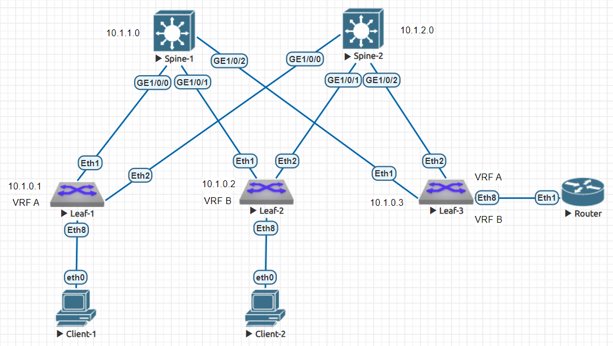

# Настройка VxLAN. Routing

### Цели

1. Настройка различных vrf в VxLAN фабрике
2. Анонс суммарных префиксов клиентов в Overlay сети
3. Настройка маршрутизации между клиентами через суммарный префикс
4. Проверка наличия IP связанности между клиентами

### Схема сети



Базовые настройки сети Underlay, а так же BGP EVPN были рассмотрены в рамках лабораторной работы №5. Воспользуемся ими в данной работе.

### IP план

Device|Interface|IP Address|Subnet Mask
---|---|---|---
Spine-1|Lo1|10.0.1.0|255.255.255.255
||Lo2|10.1.1.0|255.255.255.255
||GE1/0/0|10.2.1.0|255.255.255.254
||GE1/0/1|10.2.1.2|255.255.255.254
||GE1/0/2|10.2.1.4|255.255.255.254
Spine-2|Lo1|10.0.2.0|255.255.255.255
||Lo2|10.1.2.0|255.255.255.255
||GE1/0/0|10.2.2.0|255.255.255.254
||GE1/0/1|10.2.2.2|255.255.255.254
||GE1/0/2|10.2.2.4|255.255.255.254
Leaf-1|Lo1|10.0.0.1|255.255.255.255
||Lo2|10.1.0.1|255.255.255.255
||Eth1|10.2.1.1|255.255.255.254
||Eth2|10.2.2.1|255.255.255.254
|vrf A|Lo100|10.4.1.66|255.255.255.192
|vrf A|vlanif100|10.4.1.1|255.255.255.192
Leaf-2|Lo1|10.0.0.2|255.255.255.255
||Lo2|10.1.0.2|255.255.255.255
||Eth1|10.2.1.3|255.255.255.254
||Eth2|10.2.2.3|255.255.255.254
|vrf B|Lo200|10.4.2.130|255.255.255.192
|vrf B|vlanif200|10.4.2.1|255.255.255.192
Leaf-3|Lo1|10.0.0.3|255.255.255.255
||Lo2|10.1.0.3|255.255.255.255
||GE1/0/0|10.2.1.5|255.255.255.254
||GE1/0/1|10.2.2.5|255.255.255.254
|vrf A|eth8.300|192.168.0.1|255.255.255.0
|vrf B|eth8.400|192.168.1.1|255.255.255.0
Client-1|eth0|10.4.1.2|255.255.255.192
Client-2|eth0|10.4.2.2|255.255.255.192

### Настройка различных vrf (L3VNI) в VxLAN фабрике

Более подробно настройка L3VNI описана в лабораторной работе №6. Для данного стенда на Leaf-1 настроим vrf A (VNI 20000), добавим в него подсеть с Client-1 и дополнительную подсеть с интерфейса Lo100. На Leaf-2 настроим vrf B (VNI 22000), добавим в него подсеть с Client-2 и дополнительную подсеть с интерфейса Lo200.

Пример настройки Leaf-1:

```
vlan 100
!
vrf instance A
!
interface Ethernet8
   description to Client-1
   switchport access vlan 100
!
interface Loopback100
   vrf A
   ip address 10.4.1.66/26
!
interface Vlan100
   vrf A
   ip address virtual 10.4.1.1/26
!
interface Vxlan1
   vxlan source-interface Loopback1
   vxlan udp-port 4789
   vxlan vlan 100 vni 10100
   vxlan vrf A vni 20000
   vxlan learn-restrict any
!
ip routing vrf A
!
router bgp 65000
   vrf A
      rd 10.1.0.1:20000
      route-target import evpn 65000:20000
      route-target export evpn 65000:20000
      redistribute connected
```

### Анонс суммарных префиксов клиентов в Overlay сети

В качестве Border Leaf будем использовать Leaf-3. Leaf-3 поднимает BGP из каждого vrf с устройством Router и анонсирует ему суммарные сети /24.

Настроим на Leaf-3 vrf A и vrf B

```
vrf instance A
!
vrf instance B
!
interface Vxlan1
   vxlan source-interface Loopback1
   vxlan udp-port 4789
   vxlan vrf A vni 20000
   vxlan vrf B vni 22000
   vxlan learn-restrict any
!
ip routing vrf A
ip routing vrf B
!
router bgp 65000
   vrf A
      rd 10.1.0.3:20000
      route-target import evpn 65000:20000
      route-target export evpn 65000:20000
   !
   vrf B
      rd 10.1.0.3:22000
      route-target import evpn 65000:22000
      route-target export evpn 65000:22000
```

Настроим агрегацию ip маршрутов для дальнейшей передачи по BGP суммарного ip-префикса. Для этого используем команду *aggregate-address ... summary-only*

Пример настройки для каждго vrf на Leaf-3:

    router bgp 65000
       vrf A
          aggregate-address 10.4.1.0/24 summary-only
       vrf B
          aggregate-address 10.4.2.0/24 summary-only

При этом в EVPN BGP появились type 5 (ip-prefix) маршруты с суммаризированным префиском:

```
Leaf-1(config)#sh bgp evpn route-type ip-prefix ipv4
BGP routing table information for VRF default
Router identifier 10.1.0.1, local AS number 65000
Route status codes: * - valid, > - active, S - Stale, E - ECMP head, e - ECMP
                    c - Contributing to ECMP, % - Pending BGP convergence
Origin codes: i - IGP, e - EGP, ? - incomplete
AS Path Attributes: Or-ID - Originator ID, C-LST - Cluster List, LL Nexthop - Link Local Nexthop

          Network                Next Hop              Metric  LocPref Weight  Path
 * >      RD: 10.1.0.3:20000 ip-prefix 10.4.1.0/24
                                 10.0.0.3              -       100     0       i Or-ID: 10.1.0.3 C-LST: 10.1.1.0
 *        RD: 10.1.0.3:20000 ip-prefix 10.4.1.0/24
                                 10.0.0.3              -       100     0       i Or-ID: 10.1.0.3 C-LST: 10.1.2.0
 * >      RD: 10.1.0.1:20000 ip-prefix 10.4.1.0/26
                                 -                     -       -       0       i
 * >      RD: 10.1.0.1:20000 ip-prefix 10.4.1.64/26
                                 -                     -       -       0       i
 * >      RD: 10.1.0.3:22000 ip-prefix 10.4.2.0/24
                                 10.0.0.3              -       100     0       i Or-ID: 10.1.0.3 C-LST: 10.1.1.0
 *        RD: 10.1.0.3:22000 ip-prefix 10.4.2.0/24
                                 10.0.0.3              -       100     0       i Or-ID: 10.1.0.3 C-LST: 10.1.2.0
 * >      RD: 10.1.0.2:22000 ip-prefix 10.4.2.0/26
                                 10.0.0.2              -       100     0       i Or-ID: 10.1.0.2 C-LST: 10.1.1.0
 *        RD: 10.1.0.2:22000 ip-prefix 10.4.2.0/26
                                 10.0.0.2              -       100     0       i Or-ID: 10.1.0.2 C-LST: 10.1.2.0
 * >      RD: 10.1.0.2:22000 ip-prefix 10.4.2.128/26
                                 10.0.0.2              -       100     0       i Or-ID: 10.1.0.2 C-LST: 10.1.1.0
 *        RD: 10.1.0.2:22000 ip-prefix 10.4.2.128/26
                                 10.0.0.2              -       100     0       i Or-ID: 10.1.0.2 C-LST: 10.1.2.0
```

```
Leaf-1(config)#sh ip ro vrf A

VRF: A
Codes: C - connected, S - static, K - kernel,
       O - OSPF, IA - OSPF inter area, E1 - OSPF external type 1,
       E2 - OSPF external type 2, N1 - OSPF NSSA external type 1,
       N2 - OSPF NSSA external type2, B - Other BGP Routes,
       B I - iBGP, B E - eBGP, R - RIP, I L1 - IS-IS level 1,
       I L2 - IS-IS level 2, O3 - OSPFv3, A B - BGP Aggregate,
       A O - OSPF Summary, NG - Nexthop Group Static Route,
       V - VXLAN Control Service, M - Martian,
       DH - DHCP client installed default route,
       DP - Dynamic Policy Route, L - VRF Leaked,
       G  - gRIBI, RC - Route Cache Route

Gateway of last resort is not set

 C        10.4.1.0/26 is directly connected, Vlan100
 C        10.4.1.64/26 is directly connected, Loopback100
 B I      10.4.1.0/24 [200/0] via VTEP 10.0.0.3 VNI 20000 router-mac 50:00:00:d5:5d:c0 local-interface Vxlan1
```

### Настройка маршрутизации между клиентами через суммарный префикс

Настройим ip-связность между Leaf-3 (Border Leaf) и устройством Router в каждом из vrf:

Пример настройки для Leaf-3:

```
vlan 300,400
!
interface Ethernet8
   switchport trunk allowed vlan 300,400
   no switchport
!
interface Ethernet8.300
   encapsulation dot1q vlan 300
   vrf A
   ip address 192.168.0.1/24
!
interface Ethernet8.400
   encapsulation dot1q vlan 400
   vrf B
   ip address 192.168.1.1/24
```

Пример настройки для Router:

      vlan 300,400
      !
      interface Ethernet1
         shutdown
         switchport trunk allowed vlan 300,400
         no switchport
      !
      interface Ethernet1.300
         encapsulation dot1q vlan 300
         ip address 192.168.0.2/24
      !
      interface Ethernet1.400
         encapsulation dot1q vlan 400
         ip address 192.168.1.2/24

И поднимем BGP соседство между ними. Пример настройки для Leaf-3:

```
router bgp 65000
   vrf A
      router-id 192.168.0.1
      neighbor 192.168.0.2 remote-as 65100
      aggregate-address 10.4.1.0/24 summary-only
      !
      address-family ipv4
         neighbor 192.168.0.2 activate
   !
   vrf B
      router-id 192.168.1.1
      neighbor 192.168.1.2 remote-as 65100
      aggregate-address 10.4.2.0/24 summary-only
      !
      address-family ipv4
         neighbor 192.168.1.2 activate
```

Пример настройки Router:

```
route-map SINGLE_AS_OUT permit 10
   set as-path match all replacement none
!
router bgp 65100
   neighbor 192.168.0.1 remote-as 65000
   neighbor 192.168.0.1 route-map SINGLE_AS_OUT out
   neighbor 192.168.1.1 remote-as 65000
   neighbor 192.168.1.1 route-map SINGLE_AS_OUT out
   redistribute bgp leaked
   !
   address-family ipv4
      neighbor 192.168.0.1 activate
      neighbor 192.168.1.1 activate
```

*route-map SINGLE_AS_OUT* требуется для того, чтобы убрать AS 65000 (Leaf-3) из AS PATH, в противном случае, когда Leaf-3 получает маршрут от Router обратно, он его отбрасывает, так как видит в AS PATH номер своей AS.

### Проверка наличия IP связанности между клиентами

Проверяем наличия IP связанности между клиентами:

```
Client-1> ping 10.4.2.2

84 bytes from 10.4.2.2 icmp_seq=1 ttl=59 time=509.101 ms
84 bytes from 10.4.2.2 icmp_seq=2 ttl=59 time=100.584 ms
84 bytes from 10.4.2.2 icmp_seq=3 ttl=59 time=172.828 ms
84 bytes from 10.4.2.2 icmp_seq=4 ttl=59 time=82.340 ms
84 bytes from 10.4.2.2 icmp_seq=5 ttl=59 time=123.702 ms
```

Так же на Leaf-1 видим, что появились машруты type 5 ip-prefix с суммаризированными маршрутами из другой AS:

```
Leaf-1(config)#sh bgp evpn route-type ip-prefix ipv4
BGP routing table information for VRF default
Router identifier 10.1.0.1, local AS number 65000
Route status codes: * - valid, > - active, S - Stale, E - ECMP head, e - ECMP
                    c - Contributing to ECMP, % - Pending BGP convergence
Origin codes: i - IGP, e - EGP, ? - incomplete
AS Path Attributes: Or-ID - Originator ID, C-LST - Cluster List, LL Nexthop - Link Local Nexthop

          Network                Next Hop              Metric  LocPref Weight  Path
 * >      RD: 10.1.0.3:20000 ip-prefix 10.4.1.0/24
                                 10.0.0.3              -       100     0       i Or-ID: 10.1.0.3 C-LST: 10.1.1.0
 *        RD: 10.1.0.3:20000 ip-prefix 10.4.1.0/24
                                 10.0.0.3              -       100     0       i Or-ID: 10.1.0.3 C-LST: 10.1.2.0
 * >      RD: 10.1.0.3:22000 ip-prefix 10.4.1.0/24
                                 10.0.0.3              -       100     0       65100 i Or-ID: 10.1.0.3 C-LST: 10.1.1.0
 *        RD: 10.1.0.3:22000 ip-prefix 10.4.1.0/24
                                 10.0.0.3              -       100     0       65100 i Or-ID: 10.1.0.3 C-LST: 10.1.2.0
 * >      RD: 10.1.0.1:20000 ip-prefix 10.4.1.0/26
                                 -                     -       -       0       i
 * >      RD: 10.1.0.1:20000 ip-prefix 10.4.1.64/26
                                 -                     -       -       0       i
 * >      RD: 10.1.0.3:20000 ip-prefix 10.4.2.0/24
                                 10.0.0.3              -       100     0       65100 i Or-ID: 10.1.0.3 C-LST: 10.1.1.0
 *        RD: 10.1.0.3:20000 ip-prefix 10.4.2.0/24
                                 10.0.0.3              -       100     0       65100 i Or-ID: 10.1.0.3 C-LST: 10.1.2.0
 * >      RD: 10.1.0.3:22000 ip-prefix 10.4.2.0/24
                                 10.0.0.3              -       100     0       i Or-ID: 10.1.0.3 C-LST: 10.1.1.0
 *        RD: 10.1.0.3:22000 ip-prefix 10.4.2.0/24
                                 10.0.0.3              -       100     0       i Or-ID: 10.1.0.3 C-LST: 10.1.2.0
 * >      RD: 10.1.0.2:22000 ip-prefix 10.4.2.0/26
                                 10.0.0.2              -       100     0       i Or-ID: 10.1.0.2 C-LST: 10.1.1.0
 *        RD: 10.1.0.2:22000 ip-prefix 10.4.2.0/26
                                 10.0.0.2              -       100     0       i Or-ID: 10.1.0.2 C-LST: 10.1.2.0
 * >      RD: 10.1.0.2:22000 ip-prefix 10.4.2.128/26
                                 10.0.0.2              -       100     0       i Or-ID: 10.1.0.2 C-LST: 10.1.1.0
 *        RD: 10.1.0.2:22000 ip-prefix 10.4.2.128/26
                                 10.0.0.2              -       100     0       i Or-ID: 10.1.0.2 C-LST: 10.1.2.0
```

маршруты успешно добавились в нужный vrf:

```
Leaf-1(config)#sh ip ro vrf A

VRF: A
Codes: C - connected, S - static, K - kernel,
       O - OSPF, IA - OSPF inter area, E1 - OSPF external type 1,
       E2 - OSPF external type 2, N1 - OSPF NSSA external type 1,
       N2 - OSPF NSSA external type2, B - Other BGP Routes,
       B I - iBGP, B E - eBGP, R - RIP, I L1 - IS-IS level 1,
       I L2 - IS-IS level 2, O3 - OSPFv3, A B - BGP Aggregate,
       A O - OSPF Summary, NG - Nexthop Group Static Route,
       V - VXLAN Control Service, M - Martian,
       DH - DHCP client installed default route,
       DP - Dynamic Policy Route, L - VRF Leaked,
       G  - gRIBI, RC - Route Cache Route

Gateway of last resort is not set

 C        10.4.1.0/26 is directly connected, Vlan100
 C        10.4.1.64/26 is directly connected, Loopback100
 B I      10.4.1.0/24 [200/0] via VTEP 10.0.0.3 VNI 20000 router-mac 50:00:00:d5:5d:c0 local-interface Vxlan1
 B I      10.4.2.0/24 [200/0] via VTEP 10.0.0.3 VNI 20000 router-mac 50:00:00:d5:5d:c0 local-interface Vxlan1
```

И согласно трассировка, трафик из vrf A в vrf B ходит через устройство Router c IP-адресом 192.168.0.2:

```
Client-1> trace 10.4.2.2
trace to 10.4.2.2, 8 hops max, press Ctrl+C to stop
 1   10.4.1.1   13.347 ms  8.636 ms  9.782 ms
 2   192.168.0.1   42.990 ms  30.071 ms  27.061 ms
 3   192.168.0.2   98.272 ms  44.646 ms  42.662 ms
 4   192.168.1.1   53.384 ms  61.279 ms  54.841 ms
 5   10.4.2.130   72.931 ms  76.136 ms  80.250 ms
 6   *10.4.2.2   115.519 ms (ICMP type:3, code:3, Destination port unreachable)
```

### Конфигурация на оборудовании Huawei/Arista

<details>
<summary> Spine-1 </summary>

```
<Spine-1>display current-configuration
!Software Version V200R005C10SPC607B607
!Last configuration was updated at 2024-07-10 07:47:19+00:00 by SYSTEM automatically
!Last configuration was saved at 2024-07-10 16:23:18+00:00
#
sysname Spine-1
#
evpn-overlay enable
#
isis 1
 cost-style wide
 network-entity 49.0010.0100.0000.1000.00
#
interface GE1/0/0
 undo portswitch
 description to Leaf-1
 undo shutdown
 ip address 10.2.1.0 255.255.255.254
 isis enable 1
 isis circuit-type p2p
#
interface GE1/0/1
 undo portswitch
 description to Leaf-2
 undo shutdown
 ip address 10.2.1.2 255.255.255.254
 isis enable 1
 isis circuit-type p2p
#
interface GE1/0/2
 undo portswitch
 description to Leaf-3
 undo shutdown
 ip address 10.2.1.4 255.255.255.254
 isis enable 1
 isis circuit-type p2p
#
interface LoopBack1
 description Underlay
 ip address 10.0.1.0 255.255.255.255
 isis enable 1
#
interface LoopBack2
 description Overlay
 ip address 10.1.1.0 255.255.255.255
#
bgp 65000
 router-id 10.1.1.0
 group LEAVES internal
 peer LEAVES connect-interface LoopBack1
 peer 10.0.0.1 as-number 65000
 peer 10.0.0.1 group LEAVES
 peer 10.0.0.2 as-number 65000
 peer 10.0.0.2 group LEAVES
 peer 10.0.0.3 as-number 65000
 peer 10.0.0.3 group LEAVES
 #
 ipv4-family unicast
  undo peer LEAVES enable
  undo peer 10.0.0.1 enable
  undo peer 10.0.0.2 enable
  undo peer 10.0.0.3 enable
 #
 l2vpn-family evpn
  undo policy vpn-target
  peer LEAVES enable
  peer LEAVES advertise irb
  peer LEAVES reflect-client
  peer 10.0.0.1 enable
  peer 10.0.0.1 group LEAVES
  peer 10.0.0.2 enable
  peer 10.0.0.2 group LEAVES
  peer 10.0.0.3 enable
  peer 10.0.0.3 group LEAVES
#
```

</details>

<details>
<summary> Spine-2 </summary>

```
<Spine-2>display current-configuration
!Software Version V200R005C10SPC607B607
!Last configuration was updated at 2024-07-10 07:47:21+00:00 by SYSTEM automatically
!Last configuration was saved at 2024-07-09 14:59:15+00:00
#
sysname Spine-2
#
evpn-overlay enable
#
isis 1
 cost-style wide
 network-entity 49.0010.0100.0000.2000.00
#
interface GE1/0/0
 undo portswitch
 description to Leaf-1
 undo shutdown
 ip address 10.2.2.0 255.255.255.254
 isis enable 1
 isis circuit-type p2p
#
interface GE1/0/1
 undo portswitch
 description to Leaf-2
 undo shutdown
 ip address 10.2.2.2 255.255.255.254
 isis enable 1
 isis circuit-type p2p
#
interface GE1/0/2
 undo portswitch
 description to Leaf-3
 undo shutdown
 ip address 10.2.2.4 255.255.255.254
 isis enable 1
 isis circuit-type p2p
#
interface LoopBack1
 description Underlay
 ip address 10.0.2.0 255.255.255.255
 isis enable 1
#
interface LoopBack2
 description Overlay
 ip address 10.1.2.0 255.255.255.255
#
bgp 65000
 router-id 10.1.2.0
 group LEAVES internal
 peer LEAVES connect-interface LoopBack1
 peer 10.0.0.1 as-number 65000
 peer 10.0.0.1 group LEAVES
 peer 10.0.0.2 as-number 65000
 peer 10.0.0.2 group LEAVES
 peer 10.0.0.3 as-number 65000
 peer 10.0.0.3 group LEAVES
 #
 ipv4-family unicast
  undo peer LEAVES enable
  undo peer 10.0.0.1 enable
  undo peer 10.0.0.2 enable
  undo peer 10.0.0.3 enable
 #
 l2vpn-family evpn
  undo policy vpn-target
  peer LEAVES enable
  peer LEAVES advertise irb
  peer LEAVES reflect-client
  peer 10.0.0.1 enable
  peer 10.0.0.1 group LEAVES
  peer 10.0.0.2 enable
  peer 10.0.0.2 group LEAVES
  peer 10.0.0.3 enable
  peer 10.0.0.3 group LEAVES
#
```

</details>

<details>
<summary> Leaf-1 </summary>

```
Leaf-1(config)#show running-config
! Command: show running-config
! device: Leaf-1 (vEOS-lab, EOS-4.29.2F)
!
! boot system flash:/vEOS-lab.swi
!
service routing protocols model multi-agent
!
hostname Leaf-1
!
vlan 100
!
vrf instance A
!
interface Ethernet1
   description to Spine-1
   no switchport
   ip address 10.2.1.1/31
   isis enable 1
   isis network point-to-point
!
interface Ethernet2
   description to Spine-2
   no switchport
   ip address 10.2.2.1/31
   isis enable 1
   isis network point-to-point
!
interface Ethernet8
   description to Client-1
   switchport access vlan 100
!
interface Loopback1
   description Underlay
   ip address 10.0.0.1/32
   isis enable 1
!
interface Loopback2
   description Overlay
   ip address 10.1.0.1/32
!
interface Loopback100
   vrf A
   ip address 10.4.1.66/26
!
interface Vlan100
   vrf A
   ip address virtual 10.4.1.1/26
!
interface Vxlan1
   vxlan source-interface Loopback1
   vxlan udp-port 4789
   vxlan vlan 100 vni 10100
   vxlan vrf A vni 20000
   vxlan learn-restrict any
!
ip virtual-router mac-address 00:66:00:00:00:00
!
ip routing
ip routing vrf A
!
router bgp 65000
   router-id 10.1.0.1
   no bgp default ipv4-unicast
   neighbor SPINES peer group
   neighbor SPINES remote-as 65000
   neighbor SPINES update-source Loopback1
   neighbor SPINES send-community extended
   neighbor 10.0.1.0 peer group SPINES
   neighbor 10.0.2.0 peer group SPINES
   !
   vlan 100
      rd 10.1.0.1:10100
      route-target both 65000:10100
      redistribute learned
   !
   address-family evpn
      neighbor SPINES activate
   !
   vrf A
      rd 10.1.0.1:20000
      route-target import evpn 65000:20000
      route-target export evpn 65000:20000
      redistribute connected
!
router isis 1
   net 49.0010.0100.0000.0001.00
   is-type level-1
   !
   address-family ipv4 unicast
!
end
```

</details>

<details>
<summary> Leaf-2 </summary>

```
Leaf-2(config)#show running-config
! Command: show running-config
! device: Leaf-2 (vEOS-lab, EOS-4.29.2F)
!
! boot system flash:/vEOS-lab.swi
!
service routing protocols model multi-agent
!
hostname Leaf-2
!
vlan 200
!
vrf instance B
!
interface Ethernet1
   description to Spine-1
   no switchport
   ip address 10.2.1.3/31
   isis enable 1
   isis network point-to-point
!
interface Ethernet2
   description to Spine-2
   no switchport
   ip address 10.2.2.3/31
   isis enable 1
   isis network point-to-point
!
interface Ethernet8
   description to Client-2
   switchport access vlan 200
!
interface Loopback1
   description Underlay
   ip address 10.0.0.2/32
   isis enable 1
!
interface Loopback2
   description Overlay
   ip address 10.1.0.2/32
!
interface Loopback200
   vrf B
   ip address 10.4.2.130/26
!
interface Vlan200
   vrf B
   ip address virtual 10.4.2.1/26
!
interface Vxlan1
   vxlan source-interface Loopback1
   vxlan udp-port 4789
   vxlan vlan 200 vni 10200
   vxlan vrf B vni 22000
   vxlan learn-restrict any
!
ip virtual-router mac-address 00:66:00:00:00:00
!
ip routing
ip routing vrf B
!
router bgp 65000
   router-id 10.1.0.2
   no bgp default ipv4-unicast
   neighbor SPINES peer group
   neighbor SPINES remote-as 65000
   neighbor SPINES update-source Loopback1
   neighbor SPINES send-community extended
   neighbor 10.0.1.0 peer group SPINES
   neighbor 10.0.2.0 peer group SPINES
   !
   vlan 200
      rd 10.1.0.2:10100
      route-target both 65000:10100
      redistribute learned
   !
   address-family evpn
      neighbor SPINES activate
   !
   vrf B
      rd 10.1.0.2:22000
      route-target import evpn 65000:22000
      route-target export evpn 65000:22000
      redistribute connected
!
router isis 1
   net 49.0010.0100.0000.0002.00
   is-type level-1
   !
   address-family ipv4 unicast
!
end
```

</details>

<details>
<summary> Leaf-3 </summary>

```
Leaf-3(config)#show running-config
! Command: show running-config
! device: Leaf-3 (vEOS-lab, EOS-4.29.2F)
!
! boot system flash:/vEOS-lab.swi
!
service routing protocols model multi-agent
!
hostname Leaf-3
!
vlan 300,400
!
vrf instance A
!
vrf instance B
!
interface Ethernet1
   description to Spine-1
   no switchport
   ip address 10.2.1.5/31
   isis enable 1
   isis network point-to-point
!
interface Ethernet2
   description to Spine-2
   no switchport
   ip address 10.2.2.5/31
   isis enable 1
   isis network point-to-point
!
interface Ethernet8
   switchport trunk allowed vlan 300,400
   no switchport
!
interface Ethernet8.300
   encapsulation dot1q vlan 300
   vrf A
   ip address 192.168.0.1/24
!
interface Ethernet8.400
   encapsulation dot1q vlan 400
   vrf B
   ip address 192.168.1.1/24
!
interface Loopback1
   description Underlay
   ip address 10.0.0.3/32
   isis enable 1
!
interface Loopback2
   description Overlay
   ip address 10.1.0.3/32
!
interface Vxlan1
   vxlan source-interface Loopback1
   vxlan udp-port 4789
   vxlan vrf A vni 20000
   vxlan vrf B vni 22000
   vxlan learn-restrict any
!
ip routing
ip routing vrf A
ip routing vrf B
!
router bgp 65000
   router-id 10.1.0.3
   neighbor SPINES peer group
   neighbor SPINES remote-as 65000
   neighbor SPINES update-source Loopback1
   neighbor SPINES send-community extended
   neighbor 10.0.1.0 peer group SPINES
   neighbor 10.0.2.0 peer group SPINES
   !
   address-family evpn
      neighbor SPINES activate
   !
   vrf A
      rd 10.1.0.3:20000
      route-target import evpn 65000:20000
      route-target export evpn 65000:20000
      router-id 192.168.0.1
      neighbor 192.168.0.2 remote-as 65100
      aggregate-address 10.4.1.0/24 summary-only
      !
      address-family ipv4
         neighbor 192.168.0.2 activate
   !
   vrf B
      rd 10.1.0.3:22000
      route-target import evpn 65000:22000
      route-target export evpn 65000:22000
      router-id 192.168.1.1
      neighbor 192.168.1.2 remote-as 65100
      aggregate-address 10.4.2.0/24 summary-only
      !
      address-family ipv4
         neighbor 192.168.1.2 activate
!
router isis 1
   net 49.0010.0100.0000.0003.00
   is-type level-1
   !
   address-family ipv4 unicast
!
end
```

</details>

<details>
<summary> Router </summary>

```
Router(config)#show running-config
! Command: show running-config
! device: Router (vEOS-lab, EOS-4.29.2F)
!
! boot system flash:/vEOS-lab.swi
!
service routing protocols model ribd
!
hostname Router
!
vlan 300,400
!
interface Ethernet1
   switchport trunk allowed vlan 300,400
   no switchport
!
interface Ethernet1.300
   encapsulation dot1q vlan 300
   ip address 192.168.0.2/24
!
interface Ethernet1.400
   encapsulation dot1q vlan 400
   ip address 192.168.1.2/24
!
ip routing
!
route-map SINGLE_AS_OUT permit 10
   set as-path match all replacement none
!
router bgp 65100
   neighbor 192.168.0.1 remote-as 65000
   neighbor 192.168.0.1 route-map SINGLE_AS_OUT out
   neighbor 192.168.1.1 remote-as 65000
   neighbor 192.168.1.1 route-map SINGLE_AS_OUT out
   redistribute bgp leaked
   !
   address-family ipv4
      neighbor 192.168.0.1 activate
      neighbor 192.168.1.1 activate
!
end
```

</details>

<details>
<summary> Client-1 / Client-2 </summary>

```
Client-1> show ip

NAME        : Client-1[1]
IP/MASK     : 10.4.1.2/26
GATEWAY     : 10.4.1.1
DNS         :
MAC         : 00:50:79:66:68:06
LPORT       : 20000
RHOST:PORT  : 127.0.0.1:30000
MTU         : 1500

Client-2> show ip

NAME        : Client-2[1]
IP/MASK     : 10.4.2.2/26
GATEWAY     : 10.4.2.1
DNS         :
MAC         : 00:50:79:66:68:07
LPORT       : 20000
RHOST:PORT  : 127.0.0.1:30000
MTU         : 1500
```

</details>

